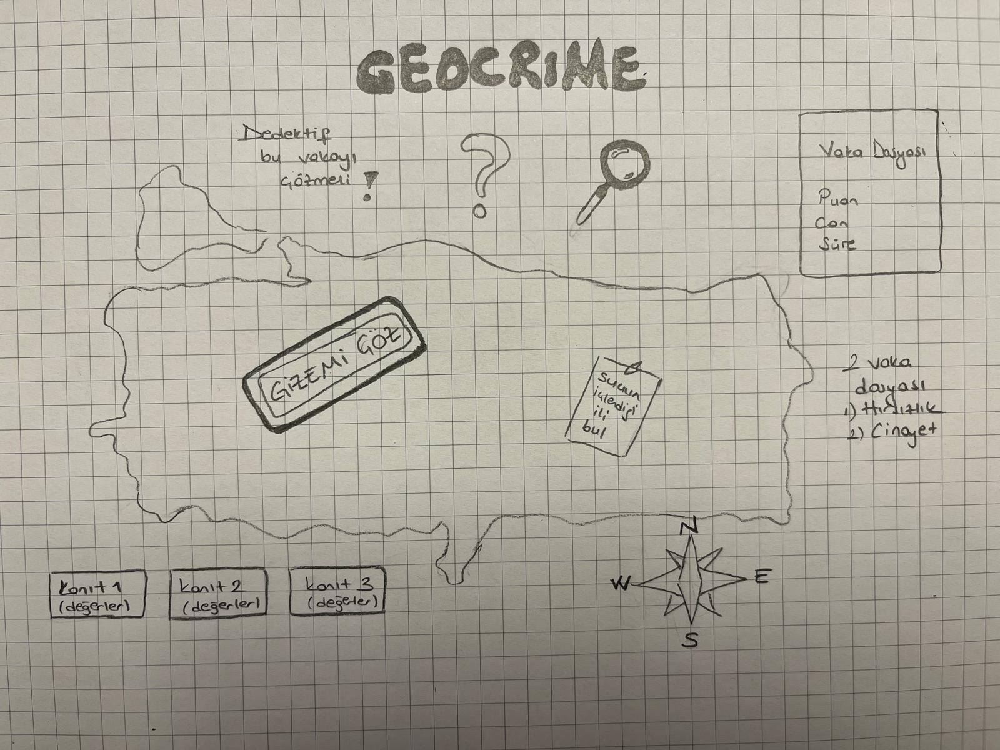
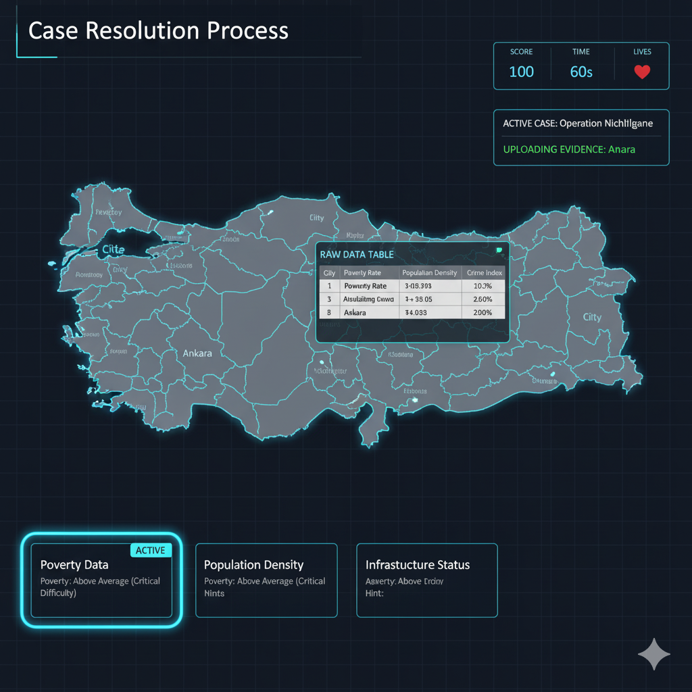
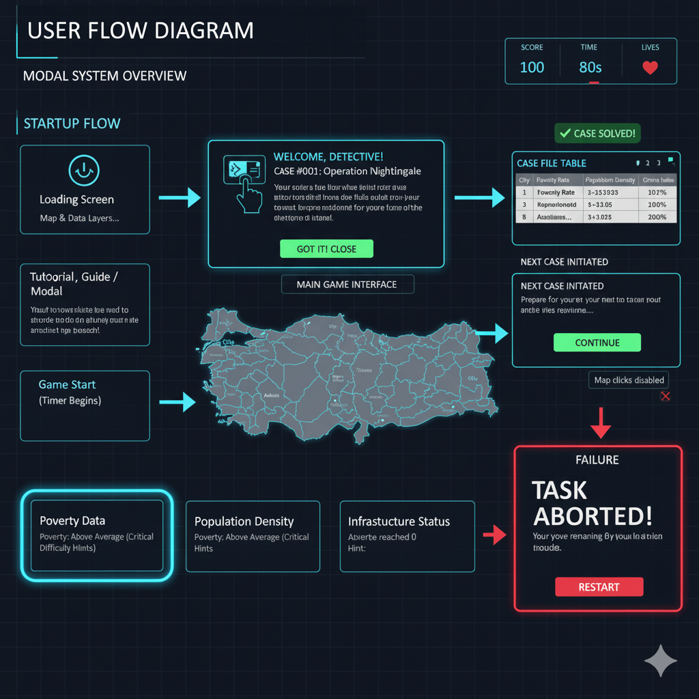

# 🕵️ GMT 458 - ASSIGNMENT 2: GeoCrime: Geospatial Query (GeoGame)

This project is a narrative-driven, **multi-case GeoGame** developed using Web GIS principles. Players solve two-stage crime scenarios (Theft and Homicide) by performing geospatial data analysis on GeoJSON datasets.

---

## 📊 Data Sources and Analytical Method

The credibility of this project relies on its use of official and verified spatial data.

* **Primary Data Source:** Data is compiled from open data sets provided by the Turkish Statistical Institute (TÜİK) and related public institutions.
* **Data Type:** Province-based **GeoJSON** data (Polygons) is used.
* **Data Categories:** Key risk indicators are available for each province:
    * **Education Level** (Years)
    * **Relative Poverty** (Percentage)
    * **Crime Profile Signals** (Ex-Convict Release Count)
    * **Population Density, Alcohol/Police Metrics, etc.** ### Analytical Approach

The game is based on the principle of Crime Geography: The player's task is to logically detect **anomalous intersections** (e.g., the overlap of High Poverty and Low Education levels) by superimposing these independent risk factors.

---

## 🎯 Project Objectives and Critical Components

| Component | Requirement Fulfillment | Description |
| :--- | :--- | :--- |
| **Two-Stage Case System** | ✅ Homicide and Theft | The player must solve two distinct scenarios (**Theft Crime (Case 1)** and **Homicide Crime (Case 2)**), demonstrating analytical flexibility. |
| **Advanced Visualization**| ✅ Choropleth & Color Consistency | All data layers are visualized using a consistent **Red-to-Green risk scale**. (Red: High Risk / Green: Low Risk). |
| **Interaction Stability**| ✅ Stable Architecture | The Permanent Border Layer (`borderLayer`) ensures provinces remain clickable regardless of which colored data layer is currently visible. |
| **Temporal & High-Score** | ✅ Yes | Includes a 60-second time limit and a points-based losing condition. |

## 🗺️ Gameplay and Case Scenarios

### Mission 1: Theft Prediction (Mülkiyet Suçu)

* **Objective:** To identify the region where the confluence of economic pressure, low education levels, and high crime propensity triggers the highest risk of theft crimes.

### Mission 2: Homicide Prediction (Cinayet Suçu)

* **Objective:** To identify the region characterized by a high rate of violence due to a combination of **high alcohol/gambling venue density**, **limited police/ambulance access**, elevated **unemployment/income inequality**, and a high crime history rate, where minor altercations can escalate to fatal violence due to substance abuse and stress.

---

## 💻 Key Code Mechanics

* **Dynamic Layer Switching:** Clicking the **Clue Cards** dynamically adds/removes the relevant GeoJSON fill layers from the map.
* **Data Cleaning:** The code uses robust data parsing (`cleanAndParseFloat`) to automatically correct local format errors (like comma-separated numbers from TÜİK data).
* **Game Conclusion:** The loss condition (Zero Score or Zero Lives) completely disables map interaction, forcing the user to restart the game.

# 🗺️ GeoCrime: Geospatial Query - Design Document

This document outlines the intended frontend structure and the step-by-step logical flow (User Experience) of the GeoCrime game, confirming the design requirements for the GMT 458 assignment.

---

### 1. 🎮 MOCKUP 1: Main Game Interface (Desktop View)

This layout is the primary screen where the player conducts the investigation. The design focuses on simplicity and data visibility.

| Label | Position | Content and Interaction |
| :--- | :--- | :--- |
| **A. Map Area** | Screen Center | Turkey's provincial borders are drawn statically. The selected clue layer (D) actively colors the map based on risk. |
| **B. Control Dashboard** | **Top Right Corner** | Displays **Score**, **Time (Temporal Component)**, and **License Points (Lives)**. Updates dynamically. |
| **C. Status/Case Text** | Inside Dashboard | Displays the active mission title and the dynamic status, such as “EVIDENCE LOADING: [Province Name]”. |
| **D. Clue Cards** | **Bottom Left Corner** | Three clickable cards. When selected, the map layer switches, and the card highlights as “ACTIVE” (for dynamic visualization). |
| **E. Analytical Hints** | Inside Clue Cards | Displays analytical hints derived from data (e.g., “Poverty: Above Average (Critical Difficulty)”). |
| **F. Raw Data Table** | Opens on Click | The table opens when a province is clicked, showing the raw statistical values for that province (initially hidden). |
| **G. Map Interaction** | Mouse Movement | When the cursor moves over a province, its border is highlighted in neon blue. |

### 2. 🧠 MOCKUP 2: User Flow Diagram (Modal and Game Flow)

This diagram outlines the interaction sequence from game entry to successful case completion, relying heavily on system modals.

#### A. Initial Entry Flow

| Step | Description |
| :--- | :--- |
| **1. Initial Load** | Map and data layers load asynchronously. |
| **2. Tutorial/Guide** | Opens automatically; introduces the rules and interface to the player (Optional aid). |
| **3. Case File** | Player closes the guide $\rightarrow$ The **"CASE MODAL"** (storytelling screen) opens to present the mission. |
| **4. Game Start** | Player closes the Case Modal $\rightarrow$ The **Timer Starts** and the active case solving process begins. |

#### B. Success / Loss Conditions

| Status | Triggering Action | Result / System Behavior |
| :--- | :--- | :--- |
| **Success** | Player clicks the correct province. | **“VAKA ÇÖZÜMLENDİ”** (Toast Notification) $\rightarrow$ Score and Lives are updated $\rightarrow$ The **“START NEXT MISSION”** modal opens for transition to the next case (if available). |
| **Loss** | Score $\le 0$ OR Lives $\le 0$. | **“GÖREV İPTAL!”** (Error notification)